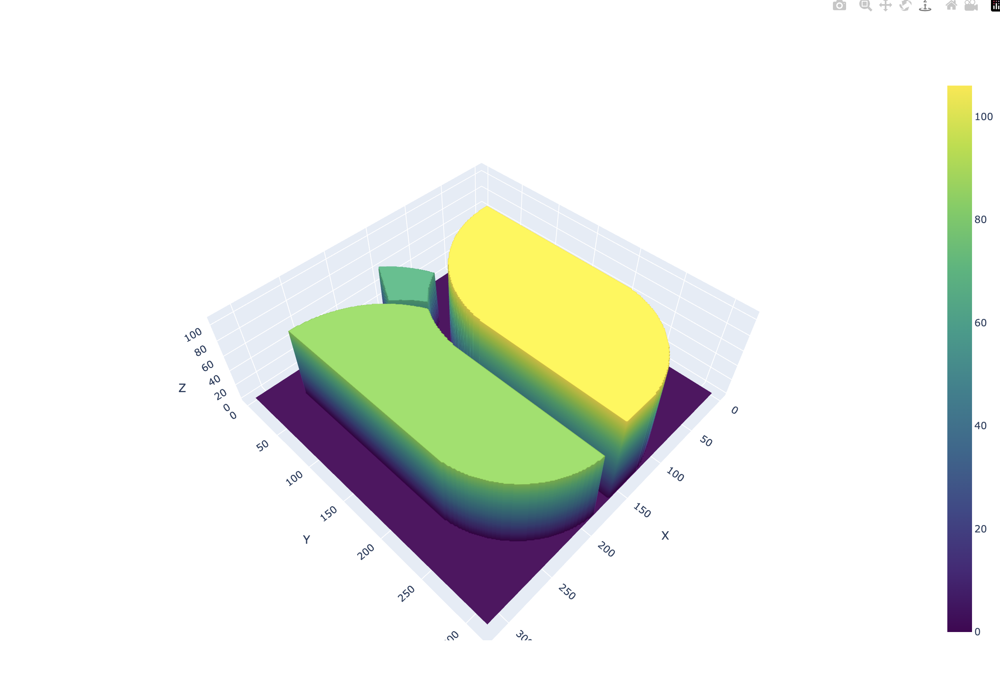
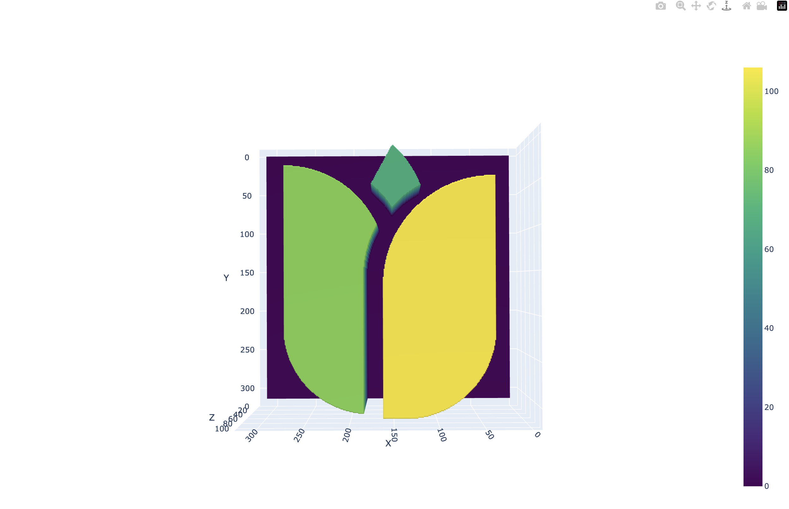
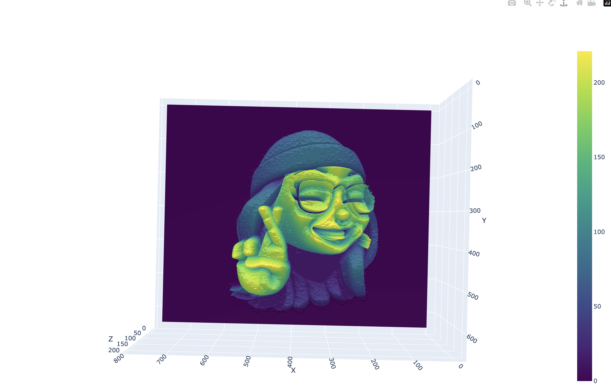
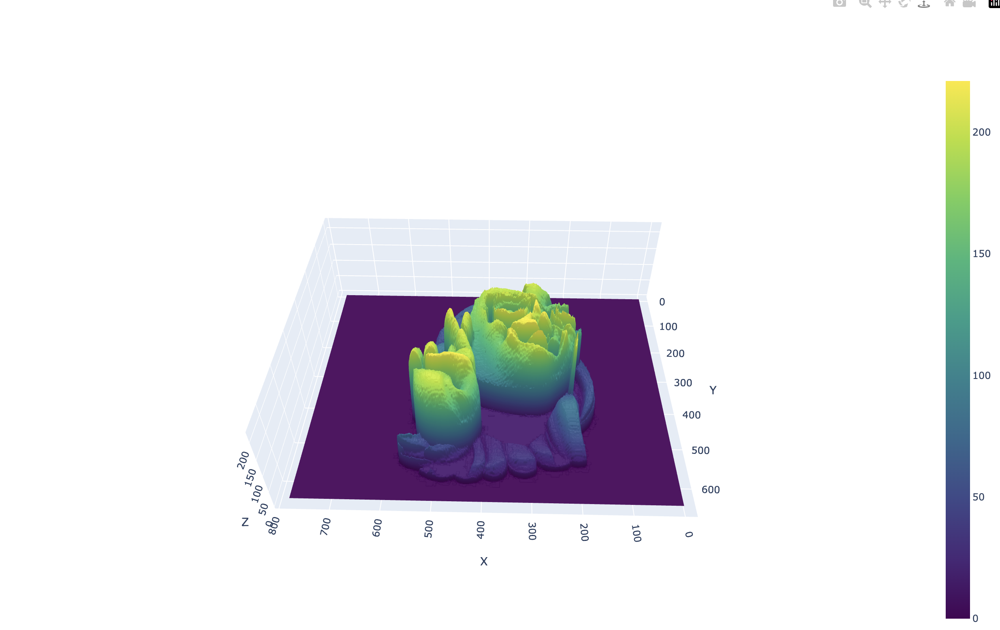

# Django Plotly 3D Plot Generator

This Django project provides an API endpoint to generate a 3D surface plot from an input image. It utilizes Plotly for plotting and Django for the web framework.

## Deployed link

<a href="https://2d-3d.jayantkhanna.in/">Go to the deployed website</a>

## Prerequisites

Make sure you have the following dependencies installed:

<ol>
<li>Python</li>
<li>Django</li>
<li>Plotly</li>
<li>NumPy</li>
<li>PIL (Python Imaging Library)</li>
</ol>

You can install them using pip:

```
pip install django plotly numpy pillow
```

Clone this repository to your local machine:

```
git clone https://github.com/ananya26-vishnoi/2d-3d-backend.git
```

Navigate to the project directory:

```
cd django_plotly_3d_plot_generator
```

Run the Django development server:

```
python manage.py runserver
```

## Screenshots










##

<a href="https://drive.google.com/file/d/1wCMMOOKsjq7v-Ml_fLVDzRSdwV2PHEdg/view?usp=sharing">Video link</a>
